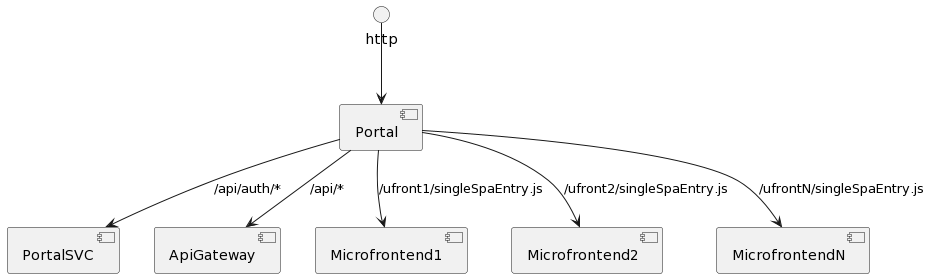

# RBAL New Luka Portal

The portal component aggregates all the microfrontends into one, cohesive application.

- [RBAL New Luka Portal](#rbal-new-luka-portal)
  - [Installation and npm registry credentials](#installation-and-npm-registry-credentials)
  - [Commands](#commands)
  - [Overall architecture](#overall-architecture)
  - [Traffic proxying](#traffic-proxying)
    - [Development mode](#development-mode)
    - [Configuring proxies for development](#configuring-proxies-for-development)
    - [Docker container](#docker-container)
  - [Portal to Microfrontend data sharing](#portal-to-microfrontend-data-sharing)
  - [References](#references)

## Installation and npm registry credentials

A private npm registisry which is used in this project is located under

```
https://rbal-365353770178.d.codeartifact.eu-central-1.amazonaws.com/npm/rbal/
```

and needs an authentication to be accessed.

To acquire the repository credentials you should follow the steps:

1. Log in into your AWS account
1. Enter the CodeArtifact and open the `rbal` domain.
1. Click _View connection instructions_ and choose `npm`
1. Open the _Manual setup_ tab.
1. Copy the command which exports the `CODEARTIFACT_AUTH_TOKEN` variable and run it in the CloudShell console.
1. Run `echo $CODEARTIFACT_AUTH_TOKEN` and append the environment variable into the `~/.bash_profile`.

```
export CODEARTIFACT_AUTH_TOKEN='__token copied from the cloudshell__'
```

This procedure gives you the access to the registry for the **12 hours**.

## Commands

| Command            | Description                     |
| ------------------ | ------------------------------- |
| `start`            | Runs the development server     |
| `check-formatting` | Checks formatting with prettier |
| `lint`             | Lints the code with the eslint  |
| `build`            | Builds the portal app           |

## Overall architecture

To combine all of the elements into an application the portal needs to
forward the incoming http traffic to multiple targets.

The responsibilities of the portal are:

1. Handle authentication flows with OpenID protocol
1. Proxy the traffic to the Backend API Gateway
1. Proxy the traffic to microfrontend applications
1. Handle top-level routings in the application



## Traffic proxying

The traffic proxying needs to be set up in a two ways.

### Development mode

In the development mode proxying is handled by the Vite dev server.
Configuration is located at [./vite.config.ts](./vite.config.ts).

The development configuration assumes that the under the proxied path
there is a Vite development server running, serving the microfrontend files.
Therefore, the microfrontend entry file (which is by default `/singleSpaEntry.js`) must be proxied to
`/src/singleSpaEntry.ts` instead.

### Configuring proxies for development

In a basic scenario it should be possible to run & develop portal without running all other applications.

By default portal connects to its dependencies (microfrontends and backends)
deployed to test environments.

The initial configuration of the proxies is present in the [./proxyConfigs.ts](./proxyConfigs.ts).

To override the default config you can create a `proxyOverrides.json` file in the root
directory and override the environment for the specific application. The `proxyOverrides.json` is configured **not** to be versioned with Git.

For example, when a developer needs to load `customer-overview-ufront` from the localhost a following `proxyOverrides.json` file needs to be created:

```jsonc
// ./proxyOverrides.json
{
  "customerOverviewUfront": "local"
}
```

### Docker container

In the development mode proxying is handled by the Vite dev server.
Configuration is located at [./nginx.conf](./nginx.conf).

## Portal to Microfrontend data sharing

The portal has a capability to pass properties to the microfrontends when they are mounted.

Each microfrontend gets access to shared data store and a theme object to be used with the
ui-library.

The shared data store uses [Zustand](https://www.npmjs.com/package/zustand) library to expose subscribtion mechanisms.

## References

- SingleSpa Framework: https://single-spa.js.org/docs/getting-started-overview
- SingleSpa Parcel's documentation: https://single-spa.js.org/docs/parcels-overview
- UI-library: https://code.rbi.tech/raiffeisen/rbal-ui-library
